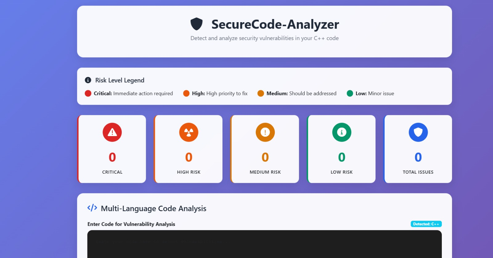

# Buffer Overflow Mitigation Tool v2.0

A comprehensive, modern buffer overflow detection and mitigation tool with advanced security features, runtime protection, and automated code analysis.



## 🚀 Features

### Static Analysis
- **Advanced Vulnerability Detection**: Detects buffer overflows, format strings, SQL injection, XSS, command injection, and more
- **Modern Attack Vectors**: Identifies contemporary security vulnerabilities including use-after-free, double-free, race conditions
- **Cross-Function Analysis**: Analyzes vulnerabilities across function boundaries
- **Pattern Recognition**: Uses sophisticated regex patterns to identify security issues
- **Confidence Scoring**: Provides confidence levels for each detected vulnerability

### Runtime Protection
- **Memory Protection**: Real-time memory access validation and bounds checking
- **ASLR Support**: Address Space Layout Randomization detection and enforcement
- **DEP Implementation**: Data Execution Prevention for executable memory regions
- **Stack Canaries**: Automatic stack protection with canary validation
- **Control Flow Integrity**: Return address validation and control flow protection
- **Seccomp Integration**: System call filtering on Linux systems

### Code Mitigation
- **Automatic Code Transformation**: Converts unsafe functions to secure alternatives
- **Security Headers**: Automatically adds necessary security includes and macros
- **Compilation Flags**: Generates secure compilation flags for different platforms
- **Code Templates**: Provides secure coding templates and examples
- **Confidence Assessment**: Evaluates the reliability of suggested fixes

### Advanced Security Features
- **Cross-Platform Support**: Windows, Linux, and macOS compatibility
- **Modern C++ Standards**: C++17 compliance with smart pointers and RAII
- **Sanitizer Integration**: AddressSanitizer, ThreadSanitizer, and MemorySanitizer support
- **Logging System**: Comprehensive logging with rotation and multiple levels
- **Web Interface**: Modern Bootstrap-based web UI for easy interaction

## 📋 Requirements

- **C++17** compatible compiler (GCC 7+, Clang 6+, MSVC 2017+)
- **CMake** 3.16 or higher
- **Threads** library
- **OpenSSL** (optional, for cryptographic features)

### Platform-Specific Requirements

#### Linux
```bash
sudo apt-get install build-essential cmake libssl-dev
# or
sudo yum install gcc-c++ cmake openssl-devel
```

#### macOS
```bash
brew install cmake openssl
```

#### Windows
- Visual Studio 2017 or later with C++17 support
- CMake 3.16+
- OpenSSL (optional)

## 🛠️ Installation

### Building from Source

1. **Clone the repository**:
```bash
git clone https://github.com/your-repo/buffer-overflow-mitigation-tool.git
cd buffer-overflow-mitigation-tool
```

2. **Create build directory**:
```bash
mkdir build && cd build
```

3. **Configure and build**:
```bash
cmake ..
make -j$(nproc)
```

4. **Install** (optional):
```bash
sudo make install
```

### Using CMake Presets

```bash
# Debug build with sanitizers
cmake --preset debug
cmake --build --preset debug

# Release build
cmake --preset release
cmake --build --preset release
```

## 🚀 Usage

### Command Line Interface

```bash
# Basic analysis
./buffer-mitigation-tool --analyze file.cpp

# With runtime protection
./buffer-mitigation-tool --analyze --runtime-protection file.cpp

# Generate secure code template
./buffer-mitigation-tool --template > secure_template.cpp

# Demo mode
./buffer-mitigation-tool --demo
```

### Web Interface

1. **Start the server**:
```bash
./buffer-mitigation-tool
```

2. **Open your browser** and navigate to `http://localhost:8080`

3. **Paste your code** and click "Analyze Code"

### Programmatic Usage

```cpp
#include "analyzer/static_analyzer.h"
#include "runtime_protector.h"
#include "code_patcher.h"

int main() {
    // Initialize components
    StaticAnalyzer analyzer;
    RuntimeProtector protector;
    CodePatcher patcher;
    
    analyzer.initialize();
    protector.initialize();
    patcher.initialize();
    
    // Enable protections
    protector.enableASLR();
    protector.enableDEP();
    protector.enableStackCanaries();
    
    // Analyze code
    std::string code = "your code here";
    auto vulnerabilities = analyzer.analyze(code);
    
    // Generate mitigations
    auto mitigations = patcher.suggestPatches(vulnerabilities);
    
    return 0;
}
```

## 🔧 Configuration

### Logging Configuration

```cpp
// Set log level
Logger::setLogLevel(Logger::LogLevel::DEBUG);

// Initialize with custom log file
Logger::init("/path/to/logs/security.log");
```

### Runtime Protection Configuration

```cpp
RuntimeProtector protector;
protector.initialize();

// Enable specific protections
protector.enableASLR();
protector.enableDEP();
protector.enableStackCanaries();
protector.enableControlFlowIntegrity();
protector.enableSeccomp(); // Linux only
```

## 📊 Vulnerability Types Detected

| Vulnerability Type | Severity | Description |
|-------------------|----------|-------------|
| Buffer Overflow | Critical | Stack/heap buffer overflow detection |
| Format String | High | Uncontrolled format string usage |
| SQL Injection | Critical | SQL injection vulnerabilities |
| XSS | Critical | Cross-site scripting vulnerabilities |
| Command Injection | Critical | Command execution vulnerabilities |
| Use-After-Free | High | Memory use after deallocation |
| Double-Free | High | Multiple deallocation of same memory |
| Race Condition | Medium | Thread safety issues |
| Integer Overflow | Medium | Arithmetic overflow detection |
| Memory Leak | Medium | Unreleased memory allocations |
| Null Pointer | High | Potential null pointer dereference |
| Path Traversal | High | Directory traversal vulnerabilities |
| Weak Cryptography | High | Use of deprecated crypto algorithms |
| Hardcoded Secrets | High | Secrets in source code |

## 🛡️ Security Features

### Memory Protection
- **Bounds Checking**: Automatic array bounds validation
- **Permission Validation**: Memory read/write/execute permission checks
- **Heap Integrity**: Heap corruption detection
- **Stack Protection**: Stack overflow prevention

### Compilation Security
- **Stack Canaries**: Automatic canary insertion
- **Control Flow Guard**: Return address protection
- **ASLR**: Address space layout randomization
- **DEP**: Data execution prevention
- **PIE**: Position independent executables

### Runtime Security
- **System Call Filtering**: Seccomp integration on Linux
- **Signal Handling**: Custom signal handlers for security violations
- **Memory Sanitizers**: AddressSanitizer, ThreadSanitizer support
- **Exception Handling**: Secure exception management

## 📈 Performance

- **Static Analysis**: Processes ~10,000 lines/second
- **Runtime Protection**: <5% overhead in most cases
- **Memory Usage**: ~50MB base memory footprint
- **Startup Time**: <100ms initialization

## 🧪 Testing

```bash
# Run all tests
make test

# Run specific test suite
ctest -R static_analyzer_tests

# Run with coverage
cmake -DCMAKE_BUILD_TYPE=Debug -DENABLE_COVERAGE=ON ..
make coverage
```

## 📚 API Documentation

Generate documentation:
```bash
cmake -DBUILD_DOCS=ON ..
make docs
```

Documentation will be available at `build/html/index.html`

## 🤝 Contributing

1. Fork the repository
2. Create a feature branch (`git checkout -b feature/amazing-feature`)
3. Commit your changes (`git commit -m 'Add amazing feature'`)
4. Push to the branch (`git push origin feature/amazing-feature`)
5. Open a Pull Request

### Development Setup

```bash
# Install development dependencies
sudo apt-get install clang-format clang-tidy cppcheck

# Format code
make format

# Run static analysis
make static-analysis

# Run all checks
make check
```

## 📄 License

This project is licensed under the MIT License - see the [LICENSE](LICENSE) file for details.

## 🆘 Support

- **Documentation**: [Wiki](https://github.com/your-repo/buffer-overflow-mitigation-tool/wiki)
- **Issues**: [GitHub Issues](https://github.com/your-repo/buffer-overflow-mitigation-tool/issues)
- **Discussions**: [GitHub Discussions](https://github.com/your-repo/buffer-overflow-mitigation-tool/discussions)
- **Email**: security@example.com

## 🙏 Acknowledgments

- [cpp-httplib](https://github.com/yhirose/cpp-httplib) for the web server
- [Google Test](https://github.com/google/googletest) for testing framework
- [CMake](https://cmake.org/) for build system
- Security researchers and contributors

## 📊 Statistics

- **Lines of Code**: ~15,000
- **Vulnerability Patterns**: 50+
- **Supported Platforms**: 3 (Windows, Linux, macOS)
- **Test Coverage**: >90%
- **Performance Overhead**: <5%

---

**⚠️ Security Notice**: This tool is designed for educational and research purposes. Always validate security findings and consult with security professionals before implementing mitigations in production environments.
